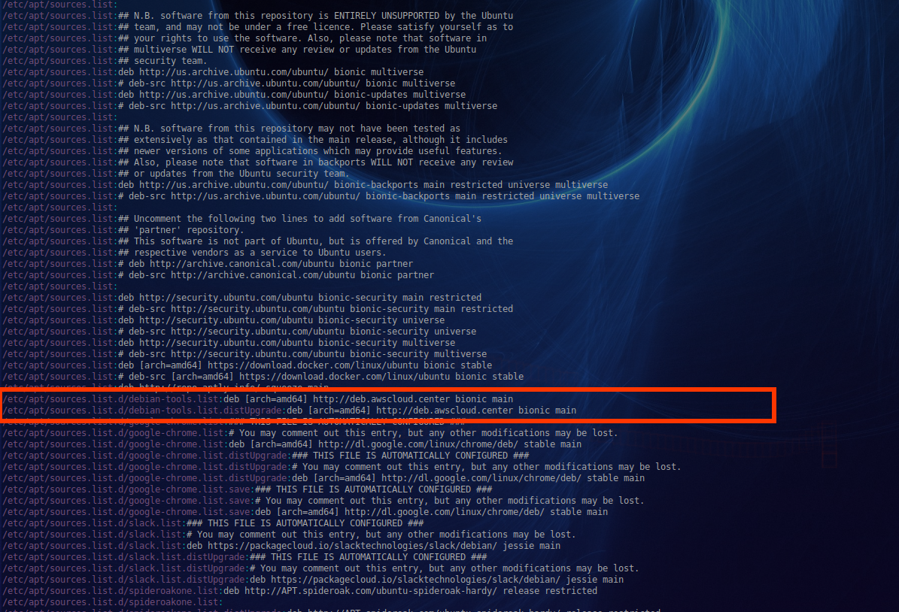

<a name="top"></a>
* * *
# branchdiff
* * *

## About this repository

* Purpose: 		Instantly know status of the current git working branch
* Version:	     1.0.16
* Repo: 		https://github.com/fstab50/branchdiff


* * *
## Contents

* [**SUMMARY**](#summary)

* [**SUPPORTED LINUX DISTRIBUTIONS**](#supported-linux-distributions)

* [**INSTALLATION**](#installation)

* [**USAGE**](#usage)

* [**SCREENSHOTS**](#screenshots)
    * [Working Branch Status](#screenshots)
    * [Working Branch Status (Extended)](#screenshots1)
    * [Commit Log History](#screenshots2)
    * [Line-by-Line Code Diff](#screenshots3)

* [**AUTHOR & COPYRIGHT**](#authorcopyright)

* [**LICENSE**](#license)

* [**DISCLAIMER**](#disclaimer)

--

[back to the top](#top)

* * *
## Summary

[branchdiff](https://github.com/fstab50/branchdiff) is a utility for use with git version control.  The program:

* Illustrates differences between current working branch and master branch
* Details when commits were made to the current branch, by whom
* Provides summary statistics

[back to the top](#top)

* * *
## Supported Linux Distributions

* Ubuntu14.04, Ubuntu 16.04, Ubuntu 18.04  
* Linux Mint 17, 18, 19
* Debian variants of Ubuntu / Linux Mint distributions above
* Redhat 7+, CentOS 7+
* Fedora 28+

[back to the top](#top)

* * *
## Installation
* * *

The easiest way to install **branchdiff** is via the Debian-tools repository:

1. Download the public key:  

    ```
    $ wget -qO - http://awscloud.center/keys/public.key | sudo apt-key add -
    ```

2. Install the repository:

    ```
    $ sudo echo "deb [arch=amd64] http://deb.awscloud.center <distribution> main" > \
                 /etc/apt/sources.list.d/debian-tools.list
    ```

    **Where:** `<distribution>` is one of the following:

    - `trusty`:  Ubuntu 14.04, Ubuntu 14.04 based Linux distributions
    - `xenial`:  Ubuntu 16.04, 16.04 based Linux distributions
    - `bionic`:  Ubuntu 18.04, 18.04 based Linux distributions ([Linux Mint 19](https://www.linuxmint.com/download.php), etc)
    - `cosmic`:  Ubuntu 18.10, 18.10 based Linux distributions

3. Verify **debian-tools** repository installation

    ```
    $  grep ^ /etc/apt/sources.list /etc/apt/sources.list.d/*
    ```

    [](https://raw.githubusercontent.com/fstab50/branchdiff/master/assets/repo-install-verify.png)

4. Update and install the package:

    ```
    $ sudo apt update  &&  sudo apt install branchdiff
    ```

5. Verify Installation.  To verify a Debian (.deb) package installation:

    ```
    $ apt show branchdiff
    ```

    

[back to the top](#top)

* * *
## Upgrading
* * *

1. See if an upgrade is available, update your distribution's package repositories:

```
$  sudo apt update
```

2. Issue a list command to see upgrades.  Alternatively, you may issue ```$ sudo apt upgrade``` command.

```
$  apt list branchdiff -a
```


3. Upgrade

```
$  sudo apt upgrade
```

[back to the top](#top)

* * *
## Usage

To display the help menu:

```bash
    $ branchdiff  --help
```

<p align="center">
  
</p>


[back to the top](#top)

* * *
## Screenshots
* * *
<a name="screenshots0"></a>
#### [Screenshots](#screenshots) / Working Branch Status

[branchdiff](https://github.com/fstab50/branchdiff) provides the status of working branch in which the cursor is located:


```bash
$ branchdiff
```

<p align="center">
  
</p>

[back to the top](#top)

* * *
<a name="screenshots1"></a>
#### [Screenshots](#screenshots) / Extended commit history

```bash
$ branchdiff
```

<p align="center">
  
</p>

[back to the top](#top)

* * *
<a name="screenshots2"></a>
#### [Screenshots](#screenshots) / Commit Log / History

[branchdiff](https://github.com/fstab50/branchdiff) accurately provides the commit age of the working branch where the cursor is located:

```bash
$ branchdiff --commit-log history
```

<p align="center">
  
</p>

[back to the top](#top)

* * *
<a name="screenshots3"></a>
#### [Screenshots](#screenshots) / Code Diff

[branchdiff](https://github.com/fstab50/branchdiff) shows the actual lines updated in the current working branch compared to the master branch.

```bash
$ branchdiff --code
```

<p align="center">
  
</p>

[back to the top](#top)

<a name="authorcopyright"></a>
* * *
## Author & Copyright

All works contained herein copyrighted via below author unless work is explicitly noted by an alternate author.

* Copyright Blake Huber, All Rights Reserved.

[back to the top](#top)

* * *

## License

* Software contained in this repository is licensed under the [MIT License](https://opensource.org/licenses/MIT).

[back to the top](#top)

* * *

## Disclaimer

The following code is provided in accordance with the strict legal disclaimer below:

*Code is provided "as is". No liability is assumed by either the code's originating author nor this repo's owner for their use at AWS or any other facility. Furthermore, running function code at AWS may incur monetary charges; in some cases, charges may be substantial. Charges are the sole responsibility of the account holder executing code obtained from this library.*

Additional terms may be found in the complete [License Agreement](https://github.com/fstab50/branchdiff/blob/master/LICENSE).

[back to the top](#top)

* * *
