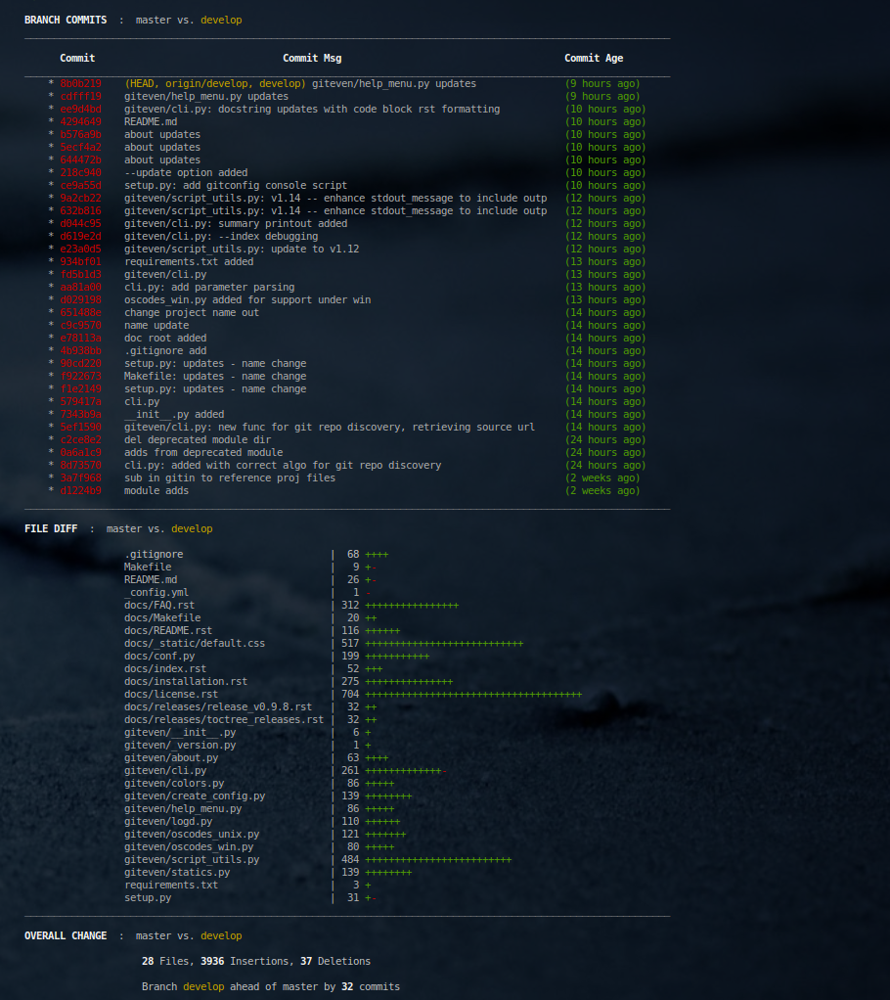

* * *
# branchdiff
* * *

## About this repository

* Purpose: 		Instantly know status of the current git working branch
* Version:	     1.0.9
* Repo: 		https://github.com/fstab50/branchdiff

* * *
## Contents
* * *

* [Summary](#markdown-header-summary)
* [Screenshots](#markdown-header-screenshots)
* [Supported Linux Distributions](#markdown-header-supported-linux-distributions)
* [Installation](#markdown-header-installation)
* [Usage](#markdown-header-usage)
* [Author & Copyright](#markdown-header-author-copyright)
* [License](#markdown-header-license)
* [Disclaimer](#markdown-header-disclaimer)

[back to the top](#markdown-header-branchdiff)

* * *
## Summary
* * *

[branchdiff](https://github.com/fstab50/branchdiff) is a utility for use with git version control.  The program:

* Illustrates differences between current working branch and master branch

* Details when commits were made to the current branch, by whom

* Provides summary statistics

[back to the top](#markdown-header-branchdiff)

## Screenshots

[back to the top](#markdown-header-branchdiff)

* * *

## Supported Linux Distributions

* TBD

[back to the top](#markdown-header-branchdiff)

* * *

## Installation

* TBD

[back to the top](#markdown-header-branchdiff)

* * *

## Author & Copyright

All works contained herein copyrighted via below author unless work is explicitly noted by an alternate author.

* Copyright Blake Huber, All Rights Reserved.

[back to the top](#markdown-header-branchdiff)

* * *

## License

* Software contained in this repository is licensed under the [MIT License]().

[back to the top](#markdown-header-branchdiff)

* * *

## Disclaimer

*Code is provided "as is". No liability is assumed by either the code's originating author nor this repo's owner for their use at AWS or any other facility. Furthermore, running function code at AWS may incur monetary charges; in some cases, charges may be substantial. Charges are the sole responsibility of the account holder executing code obtained from this library.*

Additional terms may be found in the complete [license agreement](https://bitbucket.org/blakeca00/library-utilities/src/master/LICENSE.md).

[back to the top](#markdown-header-branchdiff)

* * *
